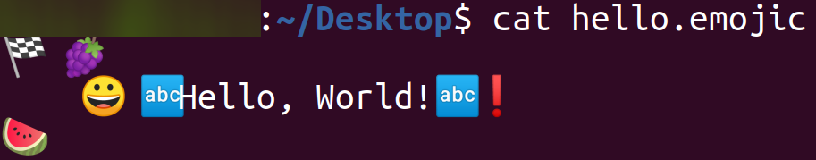
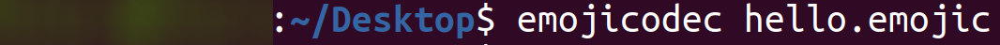
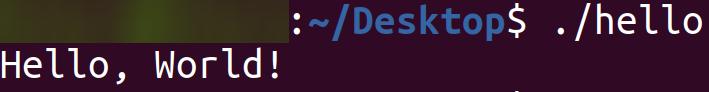

## Hello World! in [Emojicode](https://www.emojicode.org/)

### Installation

`1.)` Clone the repository
```
git clone https://github.com/DPulavarthy/guides/tree/smol-projects
```

`2.)` Install Emojicode from [here](https://www.emojicode.org/docs/guides/install.html).

### Usage

`1.)` Open the 'emojicode' folder in terminal once cloned `cd hello-world\emojicode`.

`2.)` Compile the project by running `emojicodec index.emojic`.

`3.)` Run the project with `./index`.

### Output

Code - The code of the Emojicode Hello World program.


Compile - Compiling the code to run.


Run - Running the code.
